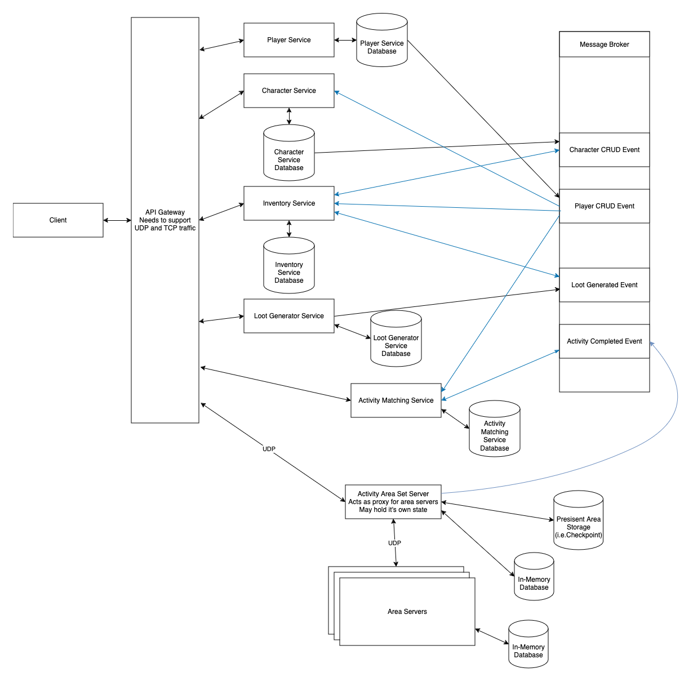

# GameServe Documentation

GameServe is intended by a collection of services/modules which can be adapted to fit your online video game. I plan to use this as a way to practice using certain technologies and languages. I'm currently working on the Item Generation Service template in a private repository.

## High Level Design

Here's a quick high level system design for GameServe. I imagine this will change as I work through the services.

# Technologies I'm using or plan to use

I'm using or plan to use these technolgies and languages if they fit the use case. My language choices I'm probably going to use regardless. But things like databases, I'll weigh up once I get to them. I plan to use the Hexagonal architecture for services, meaning anything in regards to persistance, caching, message brokers etc. will be swappable. I need to think about certain services would need to communicate using both UDP and TCP or either or.

## Using

- Go
- gRPC

## Plan

- C# + .NET
  - I'm looking at .NET Aspire
- PostgreSQL
- ScyllaDB
  - I want to try the Cassandra and DynamoDB APIs
- Valkey (Redis)
- Debezium
- Apache Kafka
- RabbitMQ
